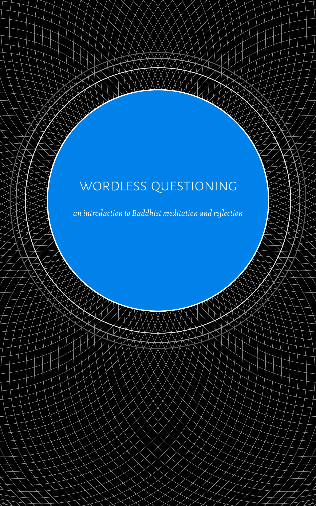

= Wordless Questioning
:booktitle: {doctitle}
:description: an introduction to Buddhist meditation and reflection
:author: Gambhīro Bhikkhu
:creator: {author}
:version: v1.0
:revdate: 2022-05-10
:doctype: book
:lang: en
:pubs-logo: sumedharama-logo-black-w150.jpg
:publisher-name: Publicações Sumedhārāma
:source: https://a-buddha-ujja.hu/
:keywords: Bhikkhu Gambhiro, meditation, Dhamma, Buddhism, RELIGION / Buddhism / Theravada
:copyright: CC-BY-NC-ND 4.0
:isbn: 978-989-8994-36-3
:identifier: isbn:{isbn}
:imagesdir: assets/photos/92dpi-ebook-sRGB
:includes: manuscript/asciidoc
:front-cover-image: 
:toc: left
:toc-title: Contents
:toclevels: 0

include::{includes}/titlepage.adoc[]

include::{includes}/00-introduction-en.adoc[]

include::{includes}/01-breathing-en.adoc[]

include::{includes}/mn118-anapanasati-excerpt-en.adoc[]

include::{includes}/02-understanding-en.adoc[]

include::{includes}/mn2-sabbasava-excerpt-en.adoc[]

include::{includes}/03-cycles-en.adoc[]

include::{includes}/04-boat-en.adoc[]

include::{includes}/05-bones-en.adoc[]

include::{includes}/06-awful-en.adoc[]

include::{includes}/07-why-en.adoc[]

include::{includes}/08-silence-en.adoc[]

include::{includes}/copyright-en.adoc[]
