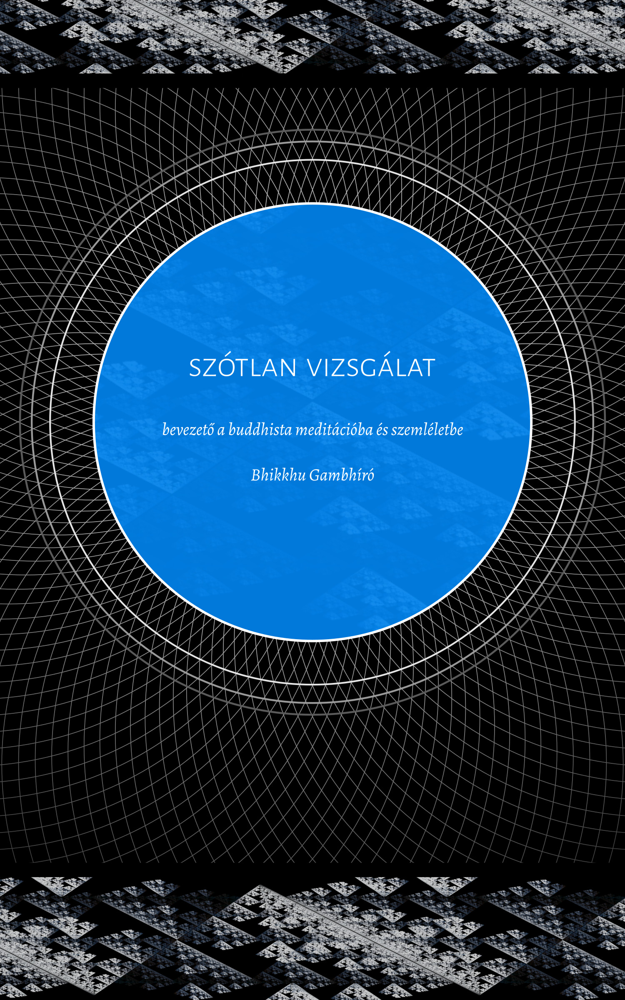

= Szótlan Vizsgálat
:booktitle: {doctitle}
:description: bevezető a buddhista meditációba és szemléletbe
:author: Bhikkhu Gambhíró
:creator: {author}
:version: v1.0
:revdate: 2022-05-10
:doctype: book
:lang: en
:pubs-logo: sumedharama-logo-black-w150.jpg
:publisher-name: Publicações Sumedhārāma
:source: https://a-buddha-ujja.hu/
:keywords: Bhikkhu Gambhíró, meditáció, Dhamma, buddhizmus, RELIGION / Buddhism / Theravada
:copyright: CC-BY-NC-ND 4.0
:isbn: 978-989-8994-38-7
:identifier: isbn:{isbn}
:imagesdir: assets/photos/92dpi-ebook-sRGB
:includes: manuscript/asciidoc
:front-cover-image: 
:toc: left
:toc-title: Tartalom
:toclevels: 0

include::{includes}/titlepage.adoc[]

include::{includes}/00-introduction-hu.adoc[]

include::{includes}/01-breathing-hu.adoc[]

include::{includes}/mn118-anapanasati-excerpt-hu.adoc[]

include::{includes}/02-understanding-hu.adoc[]

include::{includes}/mn2-sabbasava-excerpt-hu.adoc[]

include::{includes}/03-cycles-hu.adoc[]

include::{includes}/04-boat-hu.adoc[]

include::{includes}/05-bones-hu.adoc[]

include::{includes}/06-awful-hu.adoc[]

include::{includes}/07-why-hu.adoc[]

include::{includes}/08-silence-hu.adoc[]

include::{includes}/copyright-hu.adoc[]
